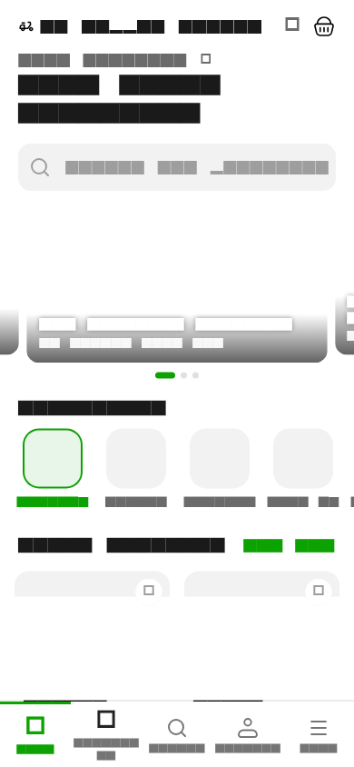
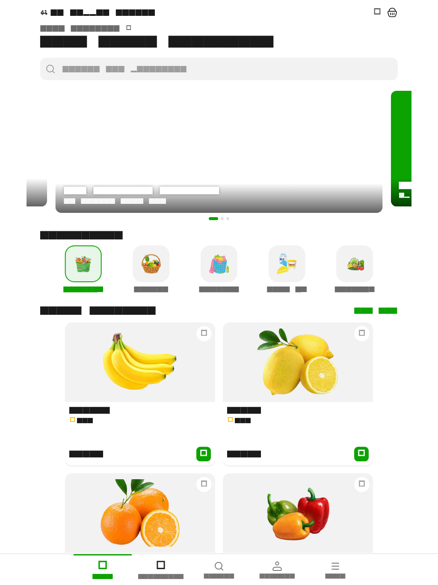

# Grabber Grocery Home Page

Grabber is a Flutter grocery Home Page built for the FAD Flutter Qualification Challenge. It includes product search, category selection, favourites, a promotional carousel, cart quantity controls, a basket sheet, and bottom navigation.

## Responsive layout

The page keeps a compact two-column product grid on phones. Tablet layouts center the content, use a larger two-column grid, and scale the header, categories, product cards, and navigation without changing the mobile design.

## Project structure

```text
lib/
├── main.dart
├── splash.dart
├── models.dart
├── core/
│   └── app_theme.dart
└── features/
    └── home/
        ├── home_data.dart
        ├── home_page.dart
        └── widgets/
            ├── home_header.dart
            ├── promo_banner.dart
            ├── category_item.dart
            ├── product_card.dart
            └── home_bottom_bars.dart
```

The header and search field share one file, as do the two bottom bars. The carousel and product card remain separate because they own state or interaction logic. Repeated category tiles also stay reusable, while the one-use section header is private to the Home Page.

## Run the project

```bash
flutter pub get
flutter run
```

To check formatting, analysis, and widget tests:

```bash
dart format .
flutter analyze
flutter test
```

The widget tests cover mobile and tablet rendering, product-grid geometry, scrolling, search, cart interaction, and layout overflows.

## Screenshots

### Mobile



### Tablet


